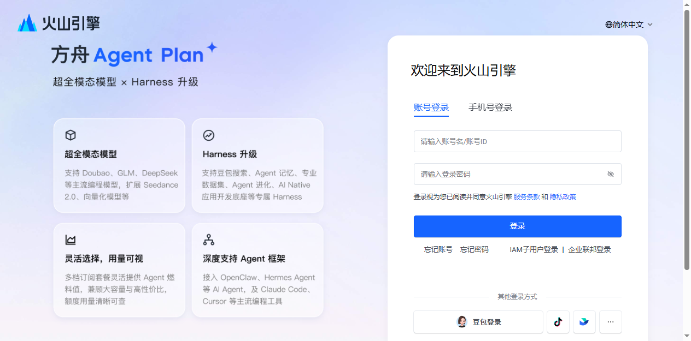
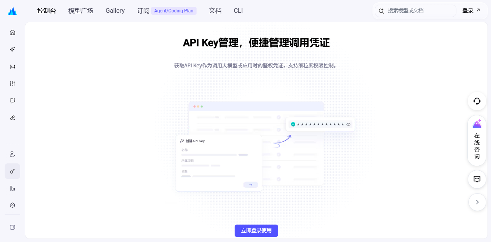
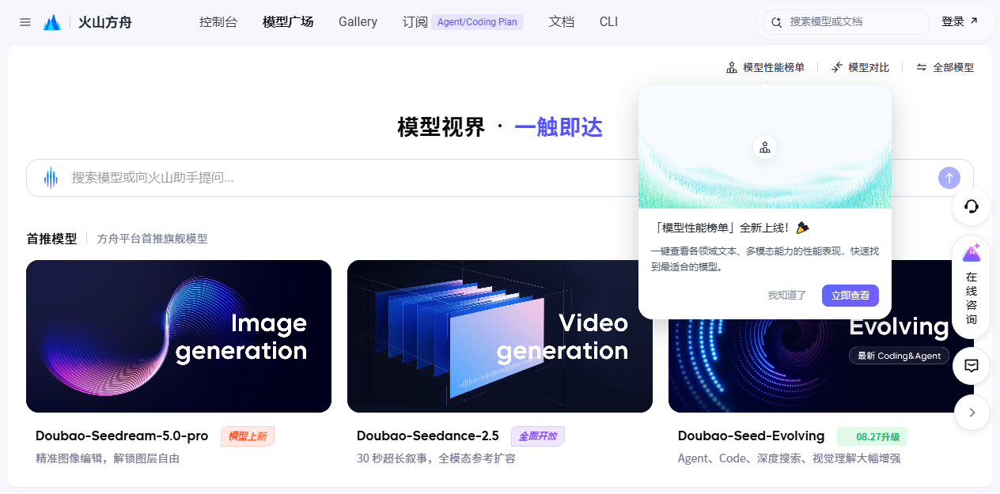
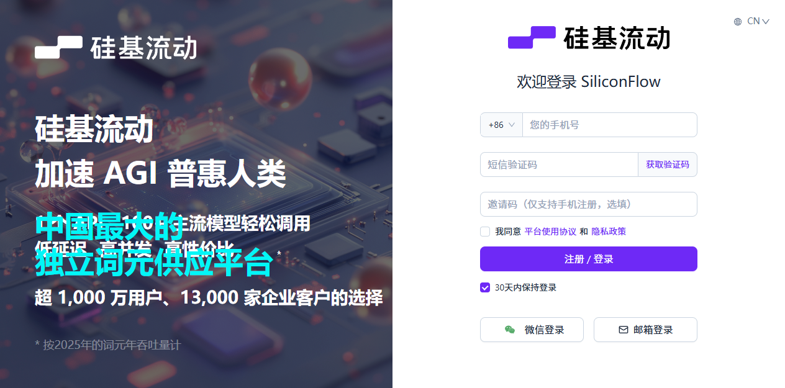

# 媒体通道使用教程：火山即梦（cv）· 火山方舟（ark）· 通用 HTTP

> 适用版本：最新版（前端「模型通道配置」弹窗 + http_presets 域名自动识别预设）
> 三种通道均在**前端登录后手动配置**（每个用户独立，无需重启服务），不再支持 `.env` 配置通道。

---

## 〇、三种通道怎么选

| | **volc_cv** 火山即梦 | **volc_ark** 火山方舟 | **generic_http** 通用 HTTP |
|---|---|---|---|
| 图片模型 | 即梦 high_aes 通用 2.1 | Seedream 5.0（写实强） | 硅基 Kolors / 智谱 CogView / OpenAI 兼容… |
| 视频模型 | 即梦 t2v_v30（5s/10s 两档） | Seedance 2.x（1~15s 任意时长，可原生音频） | Wan2.2 等（时长固定约 5s） |
| 角色一致性 | 弱（靠 prompt + 参考图） | **强**（原生参考图机制） | 取决于所选模型 |
| 图生图（白天→黑夜） | ❌ 只能文生图 | ✅ 原生支持 | ✅ 参考图自动转 base64 |
| 凭据形式 | AK/SK（AccessKey + SecretKey） | API Key（`volc-sk-` 开头） | Bearer Token（`sk-` 等） |
| 适合场景 | 快速上手、有火山账号 | **追求一致性/真人写实（推荐）** | 想用第三方聚合平台（硅基流动等） |

> 详细效果对比见 `docs/方舟Seedance升级指南.md`；硅基流动完整踩坑记录见 `docs/硅基流动视频通道配置指南.md`。

---

## 一、配置入口：前端「模型通道」弹窗（推荐）

1. 登录系统后，点击**左下角「模型通道」卡片**（或设置入口），打开配置弹窗；
2. 弹窗内分 **大模型 / 图片 / 视频** 三个标签页，每个标签页可独立选择通道；
3. 填好后点「保存」，可用「连通测试」验证（LLM 发真实 ping；图片/视频校验凭据完整性，不烧额度）；
4. 配置经 **Fernet 加密**落库，接口只回掩码；留空不改的字段自动沿用旧值；
5. **提交任务时把当前配置快照进任务**——事后再改通道，不影响已在跑的任务；但图片/视频的「重绘/重生成」会使用你**最新**的通道配置。

> ⚠️ 新版已移除「系统默认(.env)」通道选项，`.env` 里的 VOLC/LLM 仅作最后兜底，**不是配置入口**；
> 未配置任何通道前，前端会提示先完成配置再生成。

---

## 二、volc_cv · 火山即梦（视觉服务 AK/SK）

cv 通道走火山引擎**视觉智能服务**（即梦系列模型），凭据是 IAM 的 **AccessKey + SecretKey**。

### 2.1 注册账号

1. 打开 👉 **https://www.volcengine.com** → 右上角「**注册**」；
   （已注册可直接登录 👉 https://signin.volcengine.com/auth/login）

   

2. 支持手机号/邮箱注册；国内站需完成**个人或企业实名认证**（控制台内按引导操作，个人认证即可用即梦）。

### 2.2 获取 AccessKey / SecretKey

1. 登录后进入控制台 👉 **https://console.volcengine.com**；
2. 右上角头像 → **「API 访问密钥」**（或直接访问 👉 https://console.volcengine.com/iam/key/manage/ ）；
3. 点「**创建密钥**」，得到一对 **AccessKey ID** 和 **Secret Access Key**；
4. ⚠️ SecretKey 只在创建时完整显示一次，请立即复制保存。

> 也可用「子用户 IAM」密钥（权限更可控）：控制台 → IAM 子用户 → 创建用户 → 授予 `CVFullAccess` 权限 → 为该用户创建密钥。

### 2.3 开通视觉服务（即梦模型）

1. 控制台顶部搜索「**视觉智能**」或直接访问 👉 https://console.volcengine.com/cv/ ；
2. 首次使用会提示**开通服务**并同意协议（免费开通，按调用计费；即梦图片/视频有免费额度体验）。

### 2.4 模型名称（req_key）怎么填

cv 通道的「模型名」在火山体系里叫 **req_key**，常用值参考（以控制台「视觉智能 → 模型列表」实际显示为准）：

| 能力 | req_key | 说明 |
|---|---|---|
| 图片（立绘/场景图） | `jimeng_high_aes_general_v21_L` | 即梦图片 2.1 通用版 |
| 图片图生图（黑夜） | `jimeng_i2i_v30` | ⚠️ 部分账号未开放，仅方舟/HTTP 通道稳定支持图生图 |
| 视频 | `jimeng_t2v_v30` | 即梦视频 3.0；时长 121 帧≈5s / 241 帧≈10s 两档 |

### 2.5 填写方式

**前端**（模型通道 → 图片/视频 → 选「火山即梦 CV」）：

| 表单项 | 填写 |
|---|---|
| AccessKey | 你在 2.2 拿到的 AccessKey ID |
| SecretKey | 对应的 Secret Access Key |
| 模型 req_key | 手动填写上表 req_key（placeholder 给出示例，可填控制台最新模型） |

---

## 三、volc_ark · 火山方舟（Seedance / Seedream，推荐）

方舟与即梦同属火山引擎账号体系，凭据是独立的 **API Key**（`volc-sk-` 开头）。

### 3.1 开通方舟并创建 API Key

1. 用火山账号登录控制台 👉 https://console.volcengine.com ，搜索「**方舟**」进入（首次免费开通）；
2. 左侧菜单 → 「**API Key 管理**」→ 「**创建 API Key**」：

   

3. 密钥以 **`volc-sk-`** 开头，**只显示一次**，立即复制；
4. ⚠️ 方舟 Key 与即梦 AK/SK **不通用**，是两套独立凭据。

### 3.2 开通模型（重要，不开通会报 403/未授权）

1. 左侧菜单 → 「**模型广场**」：

   

2. 搜索并**开通**（免费动作，开通后才能调用）：
   - 图片：**Doubao-Seedream-5.0** 系列（如 `doubao-seedream-5-0-260128`，控制台显示为准）
   - 视频：**Doubao-Seedance** 系列（如 `doubao-seedance-2-0-260128` / 更新的 Seedance 2.5）
3. 点开模型详情页可看到**完整的模型 ID**（就是你要填的「模型名」）。

### 3.3 填写方式

**前端**（模型通道 → 图片/视频 → 选「火山方舟」）：

| 表单项 | 图片 | 视频 |
|---|---|---|
| API Key | `volc-sk-xxx`（同一个） | 同一个 `volc-sk-xxx` |
| 模型名 | `doubao-seedream-5-0-260128` | `doubao-seedance-2-0-260128` |
| 分辨率 / 宽高比 | — | 720p / 9:16 等（下拉选择） |
| 原生音频 | — | 开（Seedance 自带台词人声） |

> 切换步骤见 `docs/方舟Seedance升级指南.md`（前端弹窗操作，无需改代码/重启）。

> **为什么推荐 ark**：角色立绘多次生成不换脸、黑夜图真正基于白天图做图生图、视频 1~15s 任意时长、可原生带声音。模型名会随版本更新，**以方舟模型广场实际显示为准**。

---

## 四、generic_http · 通用 HTTP（硅基流动等 OpenAI 兼容平台）

只要平台兼容 OpenAI 风格接口，都能接。系统已内置**硅基流动、智谱 BigModel、OpenAI 官方**三套域名预设：**填根地址 + Token + 模型名 3 项即可**，提交/轮询地址、结果路径、状态枚举、参考图 base64 等技术细节由 `tools/http_presets.py` 按域名自动补全。

### 4.1 硅基流动（SiliconFlow）注册与 Key

1. 打开 👉 **https://cloud.siliconflow.cn** → 「注册/登录」（手机号验证码即可，支持微信/邮箱）：

   

2. 登录后进入控制台 → 左侧「**API 密钥**」（直达 👉 https://cloud.siliconflow.cn/account/ak ）→ 「**新建 API 密钥**」；
3. 密钥以 **`sk-`** 开头，复制保存；
4. 新账号**赠送额度**，部分模型（如 Wan2.2 视频）对实名/充值用户开放——在「模型广场」看模型卡片上的标识。

### 4.2 模型名称怎么填

硅基流动「模型广场」（👉 https://cloud.siliconflow.cn/models ）里每个模型卡片都有可复制的完整模型名：

| 能力 | 常用模型名 |
|---|---|
| 图片 | `Kwai-Kolors/Kolors` |
| 视频（图生，本项目推荐） | `Wan-AI/Wan2.2-I2V-A14B` |
| 视频（文生） | `Wan-AI/Wan2.2-T2V-A14B` |
| 大模型（LLM 标签页） | `deepseek-ai/DeepSeek-V3` 等 |

> 视频模型竖屏配 `image_size=720x1280`（高级设置或预设自动处理）；**注意 Wan2.2 不支持指定时长**，单次输出固定约 5 秒，本项目会按实际长度参与合成。

### 4.3 填写方式（图片/视频都是这 3 项）

模型通道 → 图片/视频 → 选「通用 HTTP」：

| 表单项 | 填写 |
|---|---|
| 服务地址 BaseURL | `https://api.siliconflow.cn` |
| Bearer Token | `sk-xxx`（你的硅基密钥） |
| 模型名 | 按 4.2 填写 |

保存后点「连通测试」（会真实请求只读的 `/v1/models` 验证地址与 Token）。

### 4.4 其他内置预设平台

| 平台 | BaseURL | Token | 备注 |
|---|---|---|---|
| 智谱 BigModel | `https://open.bigmodel.cn` | 平台 API Key | 👉 https://open.bigmodel.cn 注册，控制台获取 Key |
| OpenAI 官方 | `https://api.openai.com` | `sk-...` | 需海外网络与支付方式 |
| 其他兼容平台 | 平台根地址即可 | 平台 Key | 未识别域名按 OpenAI 兼容默认兜底 |

### 4.5 高级设置（特殊平台才需要）

若某平台返回结构与预设不符，展开「高级设置」可逐项覆盖（用户值优先）：提交/轮询 URL、轮询方式（GET/POST）、请求体模板（`{task_id}` 占位）、任务 ID/状态/结果路径（支持 `a[0].b` 下标语法）、成功状态枚举、参考图字段名与格式（url/base64）、附加字段 JSON（如 `{"model_size":"720x1280"}`）、需剔除的默认字段等。手把手示例见 `docs/硅基流动视频通道配置指南.md`。

---

## 五、常见问题

| 现象 | 原因与处理 |
|---|---|
| cv 报「服务未开通即梦AI」 | 火山账号没开通视觉服务，回 2.3 开通 |
| cv 报 50200 参数错误 | req_key 与账号可用水位不符；以控制台模型列表为准 |
| ark 报未授权/403 | 模型没在「模型广场」开通，或 Key 填成了即梦 AK/SK（两者不通用） |
| ark 模型名报错 | 模型 ID 以方舟模型广场详情页为准（版本号会更新） |
| http 连通测试失败 | BaseURL 只填根地址（不要带 `/v1/...` 路径）；Token 检查是否多复制了空格 |
| http 视频报 400 | 检查模型名是否完整（含组织前缀 `Wan-AI/...`）；特殊参数走高级设置附加字段 |
| 换了配置不生效 | 前端保存后**重绘/重生成**即用新配置；新建任务自然用新配置 |
| 黑夜图生成按钮灰色 | cv 通道不支持图生图，属正常保护；切 ark/HTTP 通道即可基于白天图出黑夜 |

---

*截图为未登录状态下的公开页面（2026-09 拍摄），平台界面可能随版本更新变化，以实际页面为准。*
